# Guía Básica de Django
Para aquellos que están empezando Django desde 0, está guía es para tí

<!-- toc -->

- [Primeros pasos](#primeros-pasos)
  * [Instalar Python (Windows)](#instalar-python-windows)
  * [Chequear instalación de python](#chequear-instalacion-de-python)
  * [(Opcional) Instalar Visual Studio Code](#opcional-instalar-visual-studio-code)
  * [Crear carpeta del proyecto](#crear-carpeta-del-proyecto)
  * [Crear entorno virtual](#crear-entorno-virtual)
  * [Activa el entorno virtual](#activa-el-entorno-virtual)
  * [Instalar Django](#instalar-django)
  * [Crea tu proyecto Django](#crea-tu-proyecto-django)
  * [Corriendo el proyecto](#corriendo-el-proyecto)
- [Creando un inicio de sesión](#creando-un-inicio-de-sesion)
  * [Correr migraciones](#correr-migraciones)
  * [Crear nueva app](#crear-nueva-app)
  * [Crear nuestra primera vista](#crear-nuestra-primera-vista)
  * [Crear los templates](#crear-los-templates)
  * [Crear la vista login](#crear-la-vista-login)
  * [Procesar el formulario](#procesar-el-formulario)
  * [Crear la vista de Registro](#crear-la-vista-de-registro)
  * [Repaso](#repaso)
- [Completando el CRUD](#completando-el-crud)
  * [Creando la vista de Usuarios](#creando-la-vista-de-usuarios)
  * [Zona horaria (opcional)](#zona-horaria-opcional)
  * [Haciendo la vista editar](#haciendo-la-vista-editar)
  * [Eliminar](#eliminar)
  * [Repaso](#repaso-1)
- [Arreglando rutas](#arreglando-rutas)
  * [Añadiendo algo de seguridad](#anadiendo-algo-de-seguridad)
- [Creando mi modelo](#creando-mi-modelo)
  * [Aplicando los cambios a la base de datos](#aplicando-los-cambios-a-la-base-de-datos)
  * [Creando formularios con django forms](#creando-formularios-con-django-forms)
  * [Creando vistas en Django con Clases especiales](#creando-vistas-en-django-con-clases-especiales)
- [Pendientes](#pendientes)
- [Buenas Prácticas](#buenas-practicas)
  * [Python General](#python-general)
  * [Django](#django)

<!-- tocstop -->

## Primeros pasos
### Instalar Python (Windows)
Instala la última version de python desde su [página oficial](https://www.python.org/downloads/)
al momento de instalar haz click en agregar a path para que puedas ejecutarlo desde la consola.
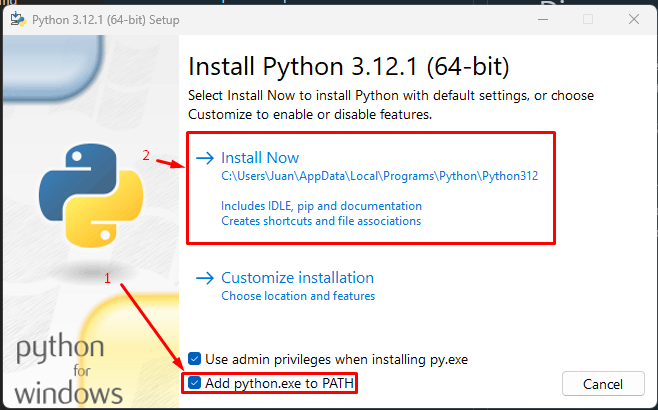

### Chequear instalación de python
En windows abre el cmd o powershell y coloca

```powershell
py --version
```

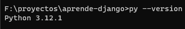

### (Opcional) Instalar Visual Studio Code 

[Página Oficial](https://code.visualstudio.com/)

### Crear carpeta del proyecto

Crea la carpeta donde estará tu proyecto Django, luego abre el cmd y ve a la carpeta que creaste
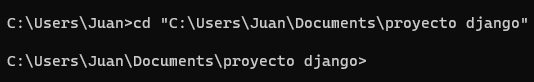

### Crear entorno virtual

Crea tu entorno virtual colocando el cmd
```powershell
py -m venv venv
```

### Activa el entorno virtual 

Esto es necesario de hacer cada vez que quieras usar el proyecto

> **Tip:** Usa la tecla tab para autocompletar el comando

```powershell
venv\Scripts\activate
```
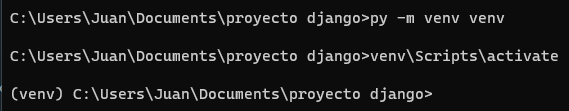


### Instalar Django

Coloca el comando 
```powershell
py -m pip install Django
```
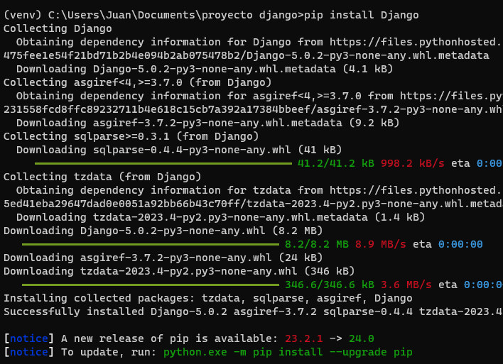


### Crea tu proyecto Django

Con el siguiente comando crearas la estructura minima necesaria para correr Django

```cmd
py -m django startproject mi_proyecto
```

### Corriendo el proyecto

Accede a la carpeta mi_proyecto desde el cmd 
```cmd
cd mi_proyecto
```
Y coloca este comando para ejecutar django:

```cmd
py manage.py runserver
```
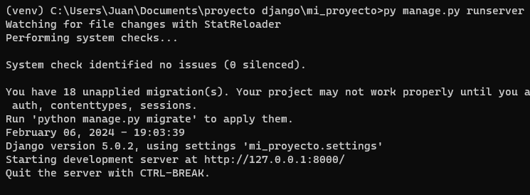

Ahora puedes acceder a tu aplicación abriendo el enlace http://127.0.0.1:8000/ en tu navegador.


¡Felicidades acabas de crear tu primer proyecto hecho en Django!
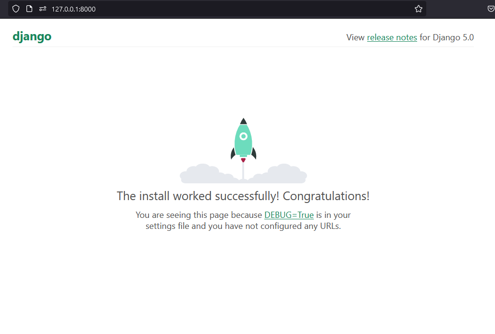

## Creando un inicio de sesión

Al crear django por default usa una base de datos SQLite, y también trae unas tablas por defecto necesarias para el funcionamiento de Django. Una de estas tablas es `User` que la puedes usar para crear usuarios en tu aplicación.

### Correr migraciones

Lo primero que tienes que hacer para que las tablas que necesita Django se creen en la base de datos es correr las migraciones (si no entiendes este concepto más adelante se explicará). El comando es
```cmd
py manage.py migrate
```
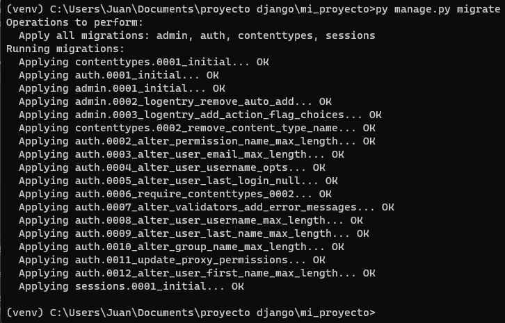


### Crear nueva app

Actualmente los archivos generados por Django son de configuración general, pero necesitamos crear nuevas apps (o puedes llamarlo módulos). Esto se hace con el comando

```cmd
python manage.py startapp auth
```

Aquí crearemos la app auth (puedes ponerle cualquier nombre). Para hacer lo que tenga que ver con registro/login.

### Crear nuestra primera vista

Para crear nuestro primero Hola Mundo accedemos al archivo auth/views.py  y colocamos este código:
```python
from django.http import HttpResponse


def index(request):
    return HttpResponse("Hola Mundo")
```
> **Tip:** Recuerda guardar los archivos cada vez que lo edites

Para acceder a la vista que creamos necesitamos crear un archivo llamado `urls.py` dentro de la carpeta `auth`, este archivo debe contener:
```python
from django.urls import path

from . import views

urlpatterns = [
    path("", views.index, name="index"),
]
```
Luego editamos el archivo `mi_proyecto/urls.py` para que nos quede así:
```python
from django.contrib import admin
from django.urls import include, path # Actualizado

urlpatterns = [
    path("", include("auth.urls")), # Actualizado
    path("admin/", admin.site.urls),
]
```

Luego si recargamos la página http://127.0.0.1:8000/  veremos nuestra vista
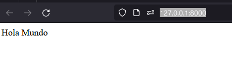

### Crear los templates

Para usar archivos html necesitamos crear la carpeta `templates`, por default django busca la carpeta `templates` en cada una de las apps instaladas. Este comportamiento lo cambiaremos para que busque la carpeta templates en el top level de nuestro proyecto (al lado del manage.py). Para esto editamos `mi_proyecto/settings.py` y vamos al apartado donde dice TEMPLATES, y lo editamos para que nos quede así
```python
TEMPLATES = [
    {
        "BACKEND": "django.template.backends.django.DjangoTemplates",
        "DIRS": [BASE_DIR / "templates"], # Actualizado
        "APP_DIRS": True,
        "OPTIONS": {
            "context_processors": [
                "django.template.context_processors.debug",
                "django.template.context_processors.request",
                "django.contrib.auth.context_processors.auth",
                "django.contrib.messages.context_processors.messages",
            ],
        },
    }
]
```
Luego creamos la carpeta templates para que nos quede así

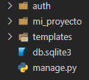

### Crear la vista login
Volvemos a `auth/views.py` y agregamos una vista para el Login, pero esta vez usando una clase en vez de una función. (Puedes usar cualquiera de los dos según te convenga)
```python
from django.views import View


def index(request):
    return HttpResponse("Hola Mundo")

# --Actualización--
class LoginView(View):
    def get(self, request):
        return render(request, 'auth/login.html')
```
> **Tip:** En Python se suele usar PascalCase para nombrar clases (Inicial de cada palabra en mayúscula. Ej: LoginView)  y snake_case para nombrar variables y funciones (todas las letras minúsculas, separadas por barra baja `_`. Ej: login_view )

Aquí nuestra vista va a renderizar el archivo `login.html` que debe estar dentro de la carpeta `auth` que a su vez debe estar dentro de la carpeta `templates`. Por lo que procedemos a crear dicha carpeta `auth` y dicho archivo `login.html`. Quedando `templates/auth/login.html`

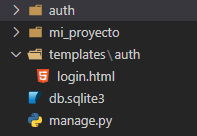

En este archivo `templates/auth/login.html` vamos a crear un formulario sencillo para iniciar sesión
```html
<h1>Inicio de sesión</h1>
<form action="" method="post">
    
    <div>
        <label>
            Usuario
            <input type="text" name="username">
        </label>
    </div>
    <div>
        <label>
            Contraseña
            <input type="password" name="password">
        </label>
    </div>
    <button type="submit">Enviar</button>
</form>
```
> **Nota:** la etiqueta `` tiene que ir obligatoriamente en los formularios con `method="post"`. De lo contrario dará error (Está es una medida de seguridad de Django contra ataques CSRF)

Agregamos nuestra vista a nuestro archivo de rutas `auth/urls.py` (cuando usamos una clase tenemos que añadir el `.as_view()`)

```python
from django.urls import path

from . import views

urlpatterns = [
    path("", views.index, name="index"),
    path("login", views.LoginView.as_view(), name="login"), #Actualizado
]
```

Y ahora vamos a ver como quedo nuestro login en http://127.0.0.1:8000/login

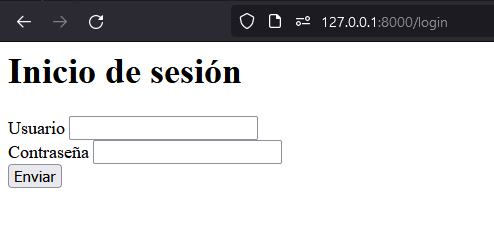
> **Tip:** Puedes añadir CSS a tu gusto ;)

### Procesar el formulario

Ahora vamos a editar nuestra vista para procesar la información del formulario con el método POST. `auth/views.py`

```python
from django.shortcuts import render
from django.http import HttpResponse
from django.contrib.auth import authenticate, login, logout # Actualización
from django.views import View


def index(request):
    return HttpResponse("Hola Mundo")


class LoginView(View):
    def get(self, request):
        return render(request, 'auth/login.html')
    # --- Actualización ---
    def post(self, request):
        username = request.POST['username']
        password = request.POST['password']
        user = authenticate(request, username=username, password=password)
        if user is not None:
            login(request, user)
            return HttpResponse("Has iniciado sesión")
        else:
            return HttpResponse("Credenciales inválidas")
```

Aquí al hacer post nuestro formulario creamos la función post de nuestra vista, aquí recuperamos los datos del formulario, luego usaremos la función de Django `authenticate`, que solicita como parámetros la petición del usuario, el nombre de usuario y la contraseña, devolviendo el usuario si existe o Nulo si no existe. Luego chequeamos si el usuario no es nulo entonces procedemos a hacer el login, sino le diremos que tiene algún dato inválido.

Pero.... Un momento, ¿Como creamos el usuario que va a hacer login?

### Crear la vista de Registro

Agregamos la vista de registro a nuestro archivo `auth/views.py`

```python
from django.shortcuts import render
from django.http import HttpResponse
from django.contrib.auth import authenticate, login
from django.views import View
from django.contrib.auth.models import User # Actualización

def index(request):
    return HttpResponse("Hola Mundo")


class LoginView(View):
    def get(self, request):
        return render(request, 'auth/login.html')

    def post(self, request):
        username = request.POST['username']
        password = request.POST['password']
        user = authenticate(request, username=username, password=password)
        if user is not None:
            login(request, user)
            return HttpResponse("Has iniciado sesión")
        else:
            return HttpResponse("Credenciales inválidas")


# --- Actualización ---
class RegisterView(View):
    def get(self, request):
        return render(request, 'auth/register.html')

    def post(self, request):
        username = request.POST['username']
        password = request.POST['password']
        user = User.objects.create_user(username=username, password=password)
        user.save()
        return HttpResponse("Usuario creado")
```
Aquí usamos el model User (que es el usuario default de Django) con su función create_user para crear un nuevo usuario con los datos recibidos del POST. 

> **Nota:** los parámetros `username` y `password` son obligatorios en la función `create_user`, sin embargo el modelo `User` tiene más campos opcionales que puedes consultar [aquí](https://docs.djangoproject.com/es/5.0/ref/contrib/auth/) 

Aquí creamos un html prácticamente idéntico al de login. Este es `templates/auth/register.html`
```html
<h1>Registro de Usuario</h1>
<form action="" method="post">
    
    <div>
        <label>
            Usuario
            <input type="text" name="username">
        </label>
    </div>
    <div>
        <label>
            Contraseña
            <input type="password" name="password">
        </label>
    </div>
    <button type="submit">Enviar</button>
</form>
<a href="/login">Iniciar sesión</a>
```

No nos olvidemos de agregar la vista que creamos a nuestras rutas `auth/urls.py` 

```python
from django.urls import path

from . import views

urlpatterns = [
    path("", views.index, name="index"),
    path("login", views.LoginView.as_view(), name="login"),
    path("register", views.RegisterView.as_view(), name="register"), # Actualización
]

```
Y ya podemos probar nuestra aplicación en http://127.0.0.1:8000/register

### Repaso

Hay datos que necesitan ser iguales para que nuestra aplicación Django funcione correctamente, algunos de estos son:

Relación parámetro `name` en los input con el `request.POST`
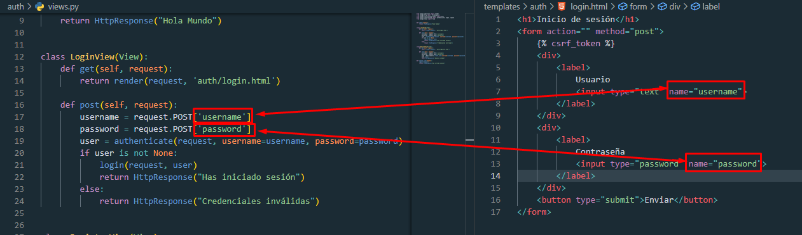
Relación entre el nombre de las vistas con las rutas
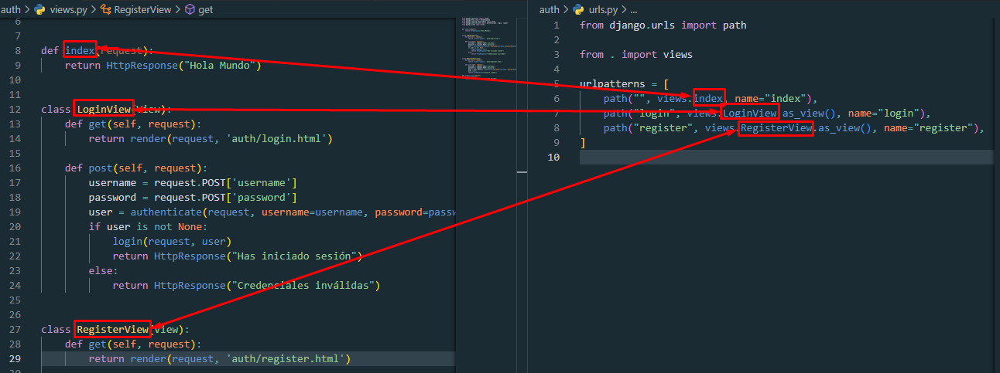
Relación de las variables con los parámetros de una función
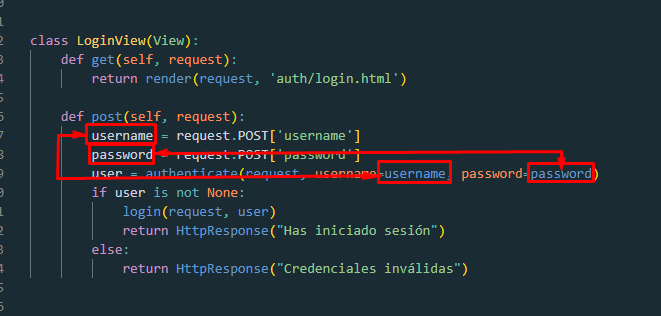
Relación de la ruta en python y la del navegador
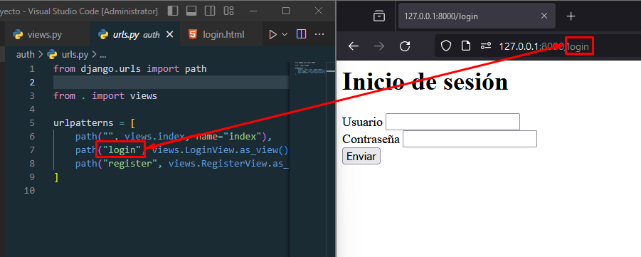

> **Recomendación:** Puedes practicar cambiando el nombre de las variables/clases/funciones que se relacionan.

## Completando el CRUD
Ya vimos como crear un usuario y hacer un login con el mismo, pero ahora veremos como podemos hacer para ver los usuarios que creamos y pode editarlos

### Creando la vista de Usuarios
Para obtener todos los registros que se han hecho en algún model usamos la función `.objects.all()`, aplicándola al model User está nos devolverá una lista con todos los usuarios registrados, esta se la asignamos a la variable `users` y se la mandamos al html para que la use como `users`

`auth/views.py`
```python
...

class UsersView(View):
    def get(self, request):
        users = User.objects.all()
        return render(request, 'auth/users.html', {'users': users})
```
> **Nota:** Los tres puntos (...) Es una referencia de que hay más código en esa posición, el que se hizo anteriormente.

Creamos el archivo `users.html` en la carpeta `templates/auth` , recorremos la variable `users` e imprimimos algunos campos que tiene el modelo `User` (puede consultar los campos que tiene  [aquí](https://docs.djangoproject.com/es/5.0/ref/contrib/auth/) )

`templates/auth/users.html`
```jinja
<style>
    td{
        border: 1px solid black;
        padding: 5px;
    }
</style>
<h1>Lista de Usuarios</h1>
<table>
    <thead>
        <tr>
            <td>ID</td>
            <td>Usuario</td>
            <td>Nombre</td>
            <td>Apellido</td>
            <td>Ultimo login</td>
            <td>Acción</td>
        </tr>
    </thead>
    <tbody>
        
            <td>{{ user.id }}</td>
            <td>{{ user.username }}</td>
            <td>{{ user.first_name }}</td>
            <td>{{ user.last_name }}</td>
            <td>{{ user.last_login }}</td>
            <td>
                <a href="#">Editar</a>
                <a href="#">Eliminar</a>
            </td>
        
    </tbody>
</table>
```
> **Nota:** se usa doble bracket `{{ }}` para imprimir una variable, y bracket porcentaje `` para la estructura lógica, como condicionales o ciclos

Añadimos nuestra nueva vista a nuestras rutas

`auth/urls.py`
```python
from django.urls import path
from . import views

urlpatterns = [
    path("", views.index, name="index"),
    path("login", views.LoginView.as_view(), name="login"),
    path("register", views.RegisterView.as_view(), name="register"),
    path("users", views.UsersView.as_view(), name="user-list"), # Nueva Línea
]
```

Ahora vamos a ver que tal nos quedo http://127.0.0.1:8000/users
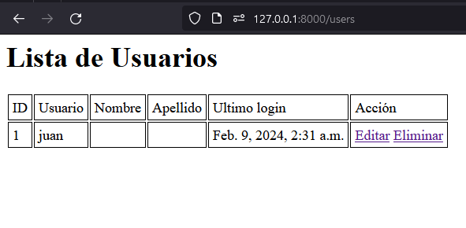

### Zona horaria (opcional)

Todo bien hasta aquí, pero...  si eres observador y has hecho la prueba te habrás preguntado, ¿Por qué último login no me muestra una hora distinta a la que en realidad hice el último login?

Esto es por la zona horaria, Django por default usa la zona horaria UTC-0. Podemos o cambiar la zona horaria a la nuestra, o si nuestra aplicación contempla usuarios de varios países cambiar la vista en función de la zona horaria del usuario (avanzado).

Por ahora optaremos por cambiar la zona horaria de django, para esto nos vamos a editar el archivo de configuración

`mi_proyecto/settings.py`

Buscamos el siguiente fragmento de código
```python
TIME_ZONE = 'UTC'
```
y lo reemplazamos con
```python
TIME_ZONE = 'America/Caracas'
```
> **Nota:** No es recomendable hacer esto si tu aplicación contempla usuarios de varios países, o tu país tiene horario de verano. Para más información [accede aquí](https://docs.djangoproject.com/en/5.0/topics/i18n/timezones/)

Actualizamos y listo ya nos muestra la hora según nuestra zona horaria
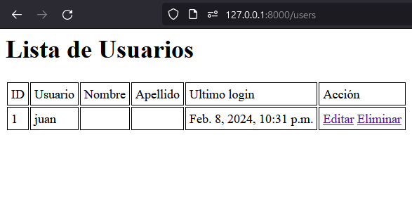

### Haciendo la vista editar

Creamos nuestra clase de editar usuario, en la que según el id que va a estar en el Url vamos a recuperar el modelo usuario, esto con la función get_object_or_404, que indica que si no consigue el modelo según los parámetros que le damos entonces devuelve un 404 (Código http que significa no encontrado).

`auth/views.py`
```python
from django.shortcuts import render, redirect, get_object_or_404 # Añadimos redirect y get_object_or_404
from django.urls import reverse
...


class UserEditView(View):
    def get(self, request, user_id):
        user = get_object_or_404(User, id=user_id)
        return render(request, 'auth/user_edit.html', {'user': user})

    def post(self, request, user_id):
        user = get_object_or_404(User, id=user_id)
        user.username = request.POST['username']
        user.first_name = request.POST['first_name']
        user.last_name = request.POST['last_name']
        password = request.POST['password']
        if password:
            user.set_password(password) 
        user.save()
        return redirect(reverse('user-list'))
```
> **Nota:** Si no queremos que automáticamente lance el error 404 al no encontrar el usuario, cambiamos el `get_object_or_404(User, id=user_id)` por `User.objects.get(id=user_id)`

Aquí tenemos nuevos conceptos nuevos, el user_id es un parámetro que pasaremos en nuestra ruta, el `redirect` es para redireccionar al usuario a la página que le pases como parámetro, y el `reverse` obtiene la ruta que tenga el nombre que le pases como parámetro (osea la ruta en el `urls.py` que tenga el `name='user-list'`). 

En el post la variable password la ponemos en una condicional, para que si la variable contiene un dato use el método `set_password` para cambiar la contraseña, en cambio si es un texto en blanco ignore la contraseña. Esto recordando que django guarda las contraseñas en forma de un [hash](https://www.redeszone.net/tutoriales/seguridad/criptografia-algoritmos-hash/) y no en texto plano.

Editamos nuestras rutas:

`auth/urls.py`
```python
from django.urls import path
from . import views

urlpatterns = [
    path("", views.index, name="index"),
    path("login", views.LoginView.as_view(), name="login"),
    path("register", views.RegisterView.as_view(), name="register"),
    path("users", views.UsersView.as_view(), name="user-list"), # Al editar el usuario reedireccionará a esta vista
    path("users/edit/<int:user_id>", views.UserEditView.as_view(), name="user-edit"), # Nueva linea, mandando el parámetro numérico(int) user_id a nuestra vista
]
```

y creamos nuestro html

`templates/auth/user_edit.html`
```jinja
<style>
div{
    margin:5px
}
</style>
<h1>Editar Usuario</h1>
<form action="" method="post">
    
    <div>
        <label>
            Usuario
            <input type="text" name="username" value="{{user.username}}">
        </label>
    </div>
    <div>
        <label>
            Contraseña 
            <input type="password" name="password">
            <p> (deja la contraseña en blanco para dejar la misma de antes) </p>
        </label>
    </div>
    <div>
        <label>
            Nombre
            <input type="text" name="first_name" value="{{user.first_name}}">
        </label>
    </div>
    <div>
        <label>
            Apellido
            <input type="text" name="last_name" value="{{user.last_name}}">
        </label>
    </div>
    <button type="submit">Enviar</button>
</form>
```

Ahora para probar nuestra vista vamos a http://127.0.0.1:8000/users/edit/1 recordando que el `1` es el id del usuario. Llenamos los campos como queramos y al guardar nos llevará a nuestra tabla mostrando los campos actualizados. 

### Eliminar

Para esto hacemos una simple vista que obtenga el id del usuario y lo elimine

`auth/views.py`
```python
...


def user_delete(request, user_id):
    user = get_object_or_404(User, id=user_id)
    user.delete()
    return redirect(reverse('user-list'))
```

Añadimos a nuestras rutas

`auth/urls.py`
```python
from django.urls import path
from . import views

urlpatterns = [
    path("", views.index, name="index"),
    path("login", views.LoginView.as_view(), name="login"),
    path("register", views.RegisterView.as_view(), name="register"),
    path("users", views.UsersView.as_view(), name="user-list"),
    path("users/edit/<int:user_id>", views.UserEditView.as_view(), name="user-edit"),
    path("users/delete/<int:user_id>", views.user_delete, name="user-delete"), # Nueva línea
]
```

Y probamos accediendo a http://127.0.0.1:8000/users/delete/1 , este nos debería redirigir a nuestra tabla, quitando el usuario que eliminamos
> **Atención:** No es recomendable eliminar un usuario ya que normalmente se relaciona con otras tablas/modelos. Esto es solo con motivos educacionales

### Repaso

Relación parámetro `name` en los path de los url con el reverse
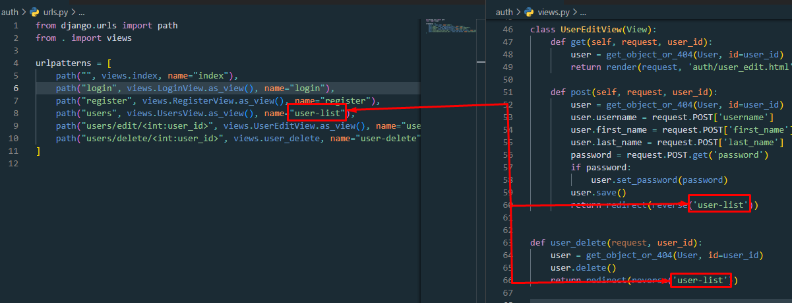
Relación entre el user_id de la ruta con el parámetro de la vista
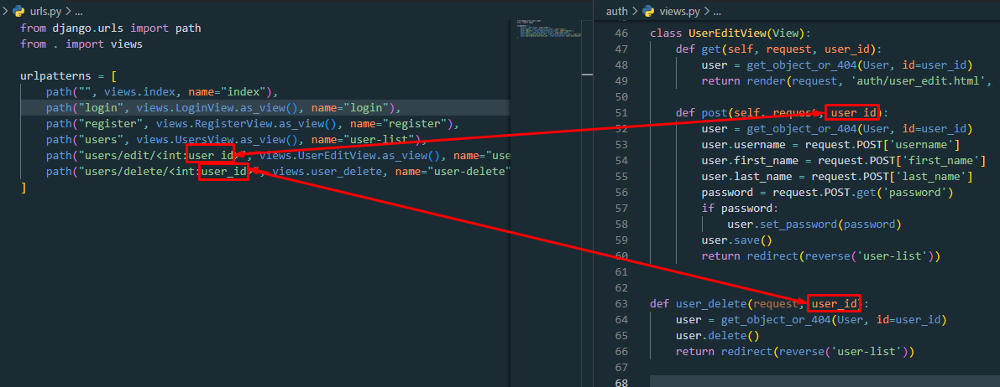
Relación de las variables de la vista con las de la plantilla
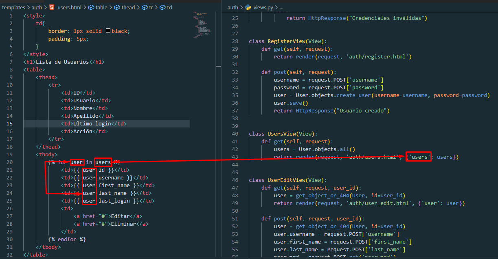

## Arreglando rutas

Nuestra aplicación va bien, aunque se siente que falta como algo ¿no?. De en vez de escribir en el navegador la ruta que queremos ver, deberíamos agregar unos links en el usuario para poder navegar de mejor forma. ¿Como hacemos esto de la manera Django?

Empezaremos creando un archivo index.html en la carpeta templates/auth , que va a ser nuestras vista inicial que de ahí nos va a reedireccionará al inicio de sesión o al registro.

`templates/auth/index.html`
```jinja
<a href="">Inicio de sesión</a>
<a href="">Registrar Usuario</a>
```
La etiqueta de django `` en el html hace exactamente lo mismo que la función `reverse` que usamos anteriormente en nuestras vistas. 

Editamos nuestra vista del index para incluir nuestro html que acabamos de crear

`auth/views.py`
```python
...

def index(request):
    return render(request, 'auth/index.html') # Línea Editada
...

```

Guardamos y ahora si accedemos a http://127.0.0.1:8000/ veremos nuestro pequeño menú funcionando.
.

Ahora necesitamos una función para cerrar sesión, y aparte aprovecharemos para mejorar redirigir al usuario a nuestra tabla cuando inicie sesión

`auth/views.py`
```python
...

from django.contrib.auth import authenticate, login, logout # Añadimos el , logout a esta línea

...

class LoginView(View):
    def get(self, request):
        return render(request, 'auth/login.html')

    def post(self, request):
        username = request.POST['username']
        password = request.POST['password']
        user = authenticate(request, username=username, password=password)
        if user is not None:
            login(request, user)
            return redirect(reverse("user-list")) # Línea Editada
        else:
            return HttpResponse("Credenciales inválidas")

...
# Vista agregada
def logout_view(request):
    logout(request)
    return redirect(reverse("login"))

```
Agregamos nuestra nueva vista a nuestras rutas

`auth/urls.py`
```python
from django.urls import path
from . import views

urlpatterns = [
    path("", views.index, name="index"),
    path("login", views.LoginView.as_view(), name="login"),
    path("register", views.RegisterView.as_view(), name="register"),
    path("users", views.UsersView.as_view(), name="user-list"),
    path("users/edit/<int:user_id>", views.UserEditView.as_view(), name="user-edit"),
    path("users/delete/<int:user_id>", views.user_delete, name="user-delete"), 
    path("logout", views.logout_view, name="logout"), # Línea agregada
]
```

Y ya tenemos nuestra función de cerra sesión hecha, ahora vamos a juntar todo en el html de nuestra tabla

`templates/auth/users.html`
```jinja
<style>
    td{
        border: 1px solid black;
        padding: 5px;
    }
</style>
<a href="">Cerrar sesión</a>
<h1>Lista de Usuarios</h1>
<table>
    <thead>
        <tr>
            <td>ID</td>
            <td>Usuario</td>
            <td>Nombre</td>
            <td>Apellido</td>
            <td>Ultimo login</td>
            <td>Acción</td>
        </tr>
    </thead>
    <tbody>
        
            <td>{{ user.id }}</td>
            <td>{{ user.username }}</td>
            <td>{{ user.first_name }}</td>
            <td>{{ user.last_name }}</td>
            <td>{{ user.last_login }}</td>
            <td>
                <a href="">Editar</a>
                <a href="">Eliminar</a>
            </td>
        
    </tbody>
</table>
```

Aquí añadimos el enlace para cerrar sesión, además que editamos los enlaces de editar y eliminar para que nos mande a su respectiva vista.

Explicación
`` lo que está dentro de las comillas es el nombre de la ruta en el `urls.py`, y lo que está afuera es los parámetros que pide la ruta. En este caso mandamos el id del usuario.
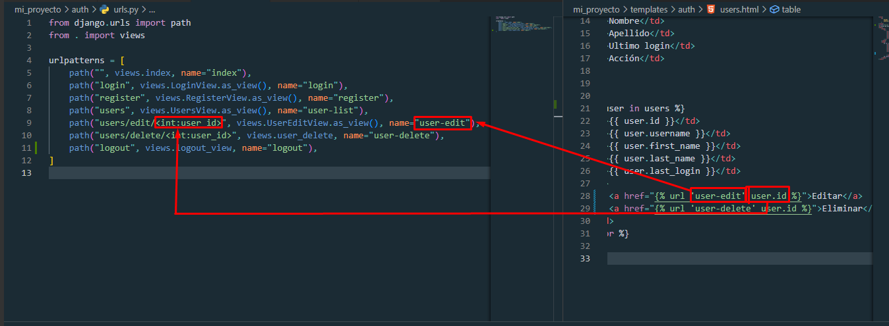.

> **Recomendación:** Como ejercicio puedes agregarle un enlace de volver a editar usuarios, así como colocar una reedirección al registrar un usuario


### Añadiendo algo de seguridad

Como ya hemos visto, cualquiera puede ver, editar y eliminar los usuarios que tenemos, aunque no hayan iniciado sesión igual nuestra aplicación les permite acceder a cualquiera, por eso editaremos nuestras vistas criticas en django para dejar pasar a la gente solo si ha iniciado sesión. Nos quedaría así;

`auth/views.py`
```python
from django.shortcuts import render, redirect, get_object_or_404
from django.http import HttpResponse
from django.contrib.auth.models import User
from django.contrib.auth import authenticate, login, logout
from django.urls import reverse
from django.views import View
from django.contrib.auth.decorators import login_required # Línea agregada
from django.contrib.auth.mixins import LoginRequiredMixin # Línea agregada

def index(request):
    return render(request, 'auth/login.html')


class LoginView(View):
    def get(self, request):
        return render(request, 'auth/login.html')

    def post(self, request):
        username = request.POST['username']
        password = request.POST['password']
        user = authenticate(request, username=username, password=password)
        if user is not None:
            login(request, user)
            return redirect(reverse("user-list"))
        else:
            return HttpResponse("Credenciales inválidas")


class RegisterView(View):
    def get(self, request):
        return render(request, 'auth/register.html')

    def post(self, request):
        username = request.POST['username']
        password = request.POST['password']
        user = User.objects.create_user(username=username, password=password)
        user.save()
        return HttpResponse("Usuario creado")
    

class UsersView(LoginRequiredMixin, View): # Línea Editada
    def get(self, request):
        users = User.objects.all()
        return render(request, 'auth/users.html', {'users': users})


class UserEditView(LoginRequiredMixin, View): # Línea editada
    def get(self, request, user_id):
        user = get_object_or_404(User, id=user_id)
        return render(request, 'auth/user_edit.html', {'user': user})

    def post(self, request, user_id):
        user = get_object_or_404(User, id=user_id)
        user.username = request.POST['username']
        user.first_name = request.POST['first_name']
        user.last_name = request.POST['last_name']
        password = request.POST.get('password')
        if password:
            user.set_password(password) 
        user.save()
        return redirect(reverse('user-list'))


@login_required # Línea agregada
def user_delete(request, user_id):
    user = get_object_or_404(User, id=user_id)
    user.delete()
    return redirect(reverse('user-list'))


@login_required # Línea agregada
def logout_view(request):
    logout(request)
    return redirect(reverse("login"))

```

Aquí usamos varios trucos de django para no permitir la entrada a la vista sino ha iniciado sesión, esto a las vistas hechas con una función (ejemplo `def user_delete(request)`) se le añade el decorador `@login_required` justo una línea encima de la función, y en caso de las vistas hechas con clases le ponemos a heredar `LoginRequiredMixin` antes del `View`, por ejemplo `class UserEditView(LoginRequiredMixin, View)` (Tiene que ser antes del `View`, porque al colocarla después no funcionará). Vamos a nuestra página http://127.0.0.1:8000/users, cerramos sesión y tratamos de acceder a la página de users sin haber iniciado a ver que pasa
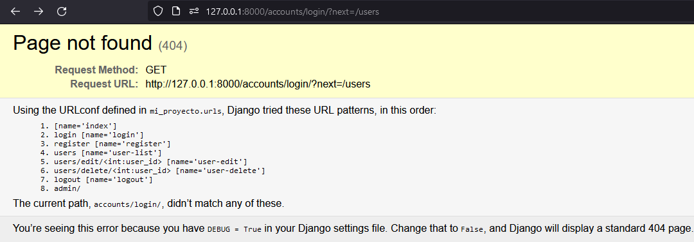.

Nos aparece un error porque django por default nos redirige a la ruta `http://127.0.0.1:8000/accounts/login/`. Ruta que no existe porque no la hemos creado, para arreglar este error configuramos el Django para indicarle cuál es nuestra ruta de inicio de sesión. Editamos el `mi_proyecto/settings.py` y añadimos al final:
```python
...
LOGIN_URL = 'login'
```
(Esto porque en nuestro `urls.py`, nuestra vista de login tiene el name='login')

Ahora cuando intentamos acceder a http://127.0.0.1:8000/users sin haber iniciado sesión nos reedirige al login

## Creando mi modelo
Ahora que hicimos un CRUD con el modelo User de Django, ahora nos toca hacer un CRUD pero con nuestro propio modelo. Tomaremos como ejemplo que somos el gerente de una concesionaria que vende autos motos y camiones. Necesitamos un sistema que nos indique autos tenemos disponibles y las características del mismo.

  Para hacer esto primero creamos otra app para separarlo de lo que hicimos anteriormente, ejecutamos el comando

```powershell
py manage.py startapp vehicles 
```

Ahora vamos a escribir nuestro primer modelo, que será el de vehículo, para esto necesitamos primero pensar que características nos interesa del vehículo para colocarlo como campos de nuestro modelo, estos pueden ser el año, marca, modelo, precio, foto, tipo(camión, auto o moto). 

Analizando estos campos podemos determinar que el modelo es un campo de texto, año es numérico, marca es texto pero varios vehículos pueden pertenecer a una misma marca, por lo tanto crearemos un modelo referenciado para este campo, precio numérico, foto es tipo archivo y tipo solo 3 opciones. Maquetando nos quedaría

>> *Nota* en los modelos  los nombres de las clases se colocan en singular, no en plural.

`vehicles/models.py`
```python
from django.db import models


class Brand(models.Model):
  name = models.CharField(max_length=100, unique=True) # Nombre de la marca, único porque no puede haber dos marcas con el mismo nombre.


class Vehicle(models.Model):
    class Type(models.IntegerChoices):
        MOTO = 1, "Moto"
        CAR = 2, "Carro"
        TRUCK = 3, "Camión"

    brand = models.ForeignKey(Brand, on_delete=models.DO_NOTHING)  # Marca
    year = models.IntegerField() # Año
    photo = models.FieldFile(upload_to="vehicles") # Foto
    type = models.IntegerField(choices=Type.choices)   # Tipo de vehículo
    model = models.CharField(max_length=100)  # Modelo del vehículo, máximo 100 caracteres
    price = models.IntegerField() # Precio
    created_at = models.DateTimeField(auto_now_add=True) # Fecha de creación, 
```

Aquí creamos una tabla de la marca, que va a hacer referenciada por la tabla vehículo, ya que varias marcas pueden tener (1) vehículo. 
En el modelo Vehículo tenemos:
1. `brand` (marca), que hace referencia al modelo `Brand` , y al eliminarse una marca no hace nada con los vehículos. Se puede colocar para cuando se elimine una marca se eliminen todos los vehículos de esa marca (models.Cascade)
2.  `year` Campo numérico que nos indica de que año es el carro
3. `photo` Campo de archivo, que guardara las fotos en la carpeta `vehicles` dentro de la carpeta media de django (Ya lo veremos más adelante)
4. `type` Tipo de vehículo, como solo son 3 tipos de vehículos ponemos un campo de opciones, creamos la clase Type que hereda `models.IntegerChoices`, Porque tiene un indice numérico (1, 2, 3) y un texto descriptivo de que es ese número. También hay [otras maneras](https://docs.djangoproject.com/en/5.0/ref/models/fields/#choices) de hacer un campo choices
5. `model` Nombre del modelo del vehículo, como todos los modelos
6. `price` Precio del vehículo 
7. `created_at` Campo de fecha y hora, que nos indica la hora y fecha exacta en la que se guarda un nuevo vehículo, con el `auto_now_add=True` le indicamos que automáticamente guarde la fecha y hora en la que se crea un nuevo modelo.

Estos es un ejemplo usando algunos tipos de campos que nos proporciona Django, para ver más tipos de campos presione [aquí](https://docs.djangoproject.com/en/5.0/ref/models/fields/) 

### Aplicando los cambios a la base de datos

Ahora que tenemos nuestro modelo necesitamos que django cree la tabla en nuestra base de datos (actualmente SQLite). Para esto primero necesitamos registrar nuestra app en el `mi_proyecto/settings.py`. Vamos donde dice INSTALLED_APPS y agregamos la siguiente línea

`mi_proyecto/settings.py`
```python
INSTALLED_APPS = [
    'django.contrib.admin',
    'django.contrib.auth',
    'django.contrib.contenttypes',
    'django.contrib.sessions',
    'django.contrib.messages',
    'django.contrib.staticfiles',
    'vehicles', # Agregamos está línea
]
```
Como el nombre de la app que creamos con el comando `py manage.py startapp vehicles` , es el de `vehicles`; Colocamos ese mismo como string en la lista de INSTALLED_APPS.

Ahora creamos las migraciones (para que Django detecte que cambios hicimos en los modelos) ejecutando en la consola
```powershell
py manage.py makemigrations
```
Ejecutamos las migraciones con
```powershell
py manage.py migrate
```
Estos dos comandos siempre los tenemos que ejecutar cuando editamos o creamos un modelo, para que puedan surtir efecto en la base de datos que estemos usando


### Creando formularios con django forms

Django tiene un "hack" para generar formularios a partir de modelos que hayamos creado. Este es una alternativa al proceso que hicimos en nuestro modulo `auth`. Para usar esta opción creamos un archivo llamado `forms.py` en nuestra carpeta `vehicles`. Aquí colocamos:

`vehicles/forms.py`
```python
from django.forms import ModelForm
from .models import Brand, Vehicle

class BrandForm(ModelForm):
    class Meta:
        model = Brand
        fields = '__all__'


class VehicleForm(ModelForm):
    class Meta:
        model = Vehicle
        exclude = ['created_at']
```
Aquí creamos nuestros formularios django a partir de nuestros modelos, Cada formulario tiene que tener una subclase llamada `Meta` y esta subclase debe tener las propiedades `model` (Que es igual al modelo que queremos representar) y `fields` (o `exclude`). `fields` puede ser una lista de los nombres de los campos que queremos procesar en nuestro formulario, ejemplo `fields = ["brand", "model"]`, o un string colocando `__all__` para usar todos los campos del modelo. Si quieres procesar todos los campos excepto alguno(s) en vez de fields usas exclude, que toma como valor una lista de los nombres de los campos que no quieres procesar. En este caso como `created_at` lo configuramos para que se asigne un valor automáticamente no necesitamos procesarlo.

Para usar estos formularios nos vamos a nuestras vistas

`vehicles/views.py`
```python
from django.shortcuts import redirect, render
from django.urls import reverse
from .models import Brand
from .forms import BrandForm

def view_brands(request):
    brands = Brand.objects.all()
    context = {'brands': brands}
    return render(request, 'vehicles/brands.html', context)

def add_brand(request):
    if request.method == 'POST':
        form = BrandForm(request.POST)
        if form.is_valid():
            form.save()
            return redirect(reverse("brand-list"))
    else:
        form = BrandForm()
    context = {'form': form}
    return render(request, 'vehicles/add_brand.html', context)

def edit_brand(request, id):
    brand = Brand.objects.get(id=id)
    if request.method == 'POST':
        form = BrandForm(request.POST, instance=brand)
        if form.is_valid():
            form.save()
            return redirect(reverse("brand-list"))
    else:
        form = BrandForm(instance=brand)
    context = {'form': form}
    return render(request, 'vehicles/add_brand.html', context)


def delete_brand(request, id):
    brand = Brand.objects.get(id=id)
    brand.delete()
    return redirect(reverse("brand-list"))

```
Aquí ya tenemos nuestro CRUD de nuestro modelo Brand hecho solo con funciones (más adelante haremos el de vehículos), como vemos importamos nuestro formulario con `from .forms import BrandForm`, en agregar lo cargamos vació `form = BrandForm()` porque lo vamos a renderizar vacío en el HTML, y necesitamos colocar el `instance` en `form = BrandForm(instance=brand)` cuando vamos a editar un modelo ya existente. Y cuando procesamos el formulario en el POST le pasamos los datos que manda el usuario `form = BrandForm(request.POST)` o `form = BrandForm(request.POST, instance=brand)` y usamos el método `form.is_valid()` para detectar que los datos que nos mande el usuario son lo que esperamos en el modelo.

Ahora necesitamos crear nuestros HTML, pero... de forma más pro 😎. Antes de crear los HTML de nuestras vistas crearemos el esqueleto que van a compartir (o en otras palabras, el menú), para esto creamos la carpeta `vehicles` en `templates` y creamos un archivo llamado `base.html`

`templates/vehicles/base.html`
```jinja
<!DOCTYPE html>
<html lang="en">
<head>
    <meta charset="UTF-8">
    <meta http-equiv="X-UA-Compatible" content="IE=edge">
    <meta name="viewport" content="width=device-width, initial-scale=1.0">
    <title>Vehículos</title>
</head>
<body>
    <nav class="navbar navbar-expand-lg bg-body-tertiary">
        <div class="container-fluid">
            <a class="navbar-brand" href="#">Aprende Django</a>
            <button class="navbar-toggler" type="button" data-bs-toggle="collapse" data-bs-target="#navbarNavAltMarkup" aria-controls="navbarNavAltMarkup" aria-expanded="false" aria-label="Toggle navigation">
                <span class="navbar-toggler-icon"></span>
            </button>
            <div class="collapse navbar-collapse" id="navbarNavAltMarkup">
                <div class="navbar-nav">
                    <a class="nav-item nav-link" href="">Usuarios</a>
                    <a class="nav-item nav-link" href="#">Productos</a>
                    <a class="nav-item nav-link" href="">Marcas</a>
                </div>
            </div>
        </div>
    </nav>
    <div class="container">
        
    </div>
</body>
</html>
```
Ahora usaremos algo de bootstrap (más información [aquí](https://getbootstrap.com/docs/5.3/getting-started/introduction/)) para mejorar nuestro estilo 😉 (aunque no nos enfocaremos en eso)

Aquí la etiqueta importante es la etiqueta ``, que significa que ahí va a estar el bloque `content`, puedes poner cuantos bloques quieras con el nombre que quieras. 

Vamos a ver como se usa esto, ahora crearemos nuestro archivo `vehicles/brands.html`

`templates/vehicles/brands.html`
```jinja



    <a href="" class="btn btn-primary">Añadir</a>

    <table class="table">
        <thead>
            <tr>
                <th>Id</th>
                <th>Nombre</th>
                <th>Acciones</th>
            </tr>
        </thead>
        <tbody>
            
            <tr>
                <td>{{ brand.id }}</td>
                <td>{{ brand.name }}</td>
                <td>
                    <a href="" class="btn btn-info">Editar</a>
                    <a href="" class="btn btn-danger">Eliminar</a>
                </td>
            </tr>
            
        </tbody>
    </table>
 
```

Aquí con la etiqueta `extends` le decimos a Django que vamos a usar la estructura de `vehicles/base.html`, y creamos nuestro bloque `content`, que se va a colocar justo donde pusimos la etiqueta `` en el archivo anterior. Cualquier código que coloques fuera de este bloque será ignorado, al igual que cualquier bloque que no esté en el `base.html`. 

Creamos los otros dos HTML que nos faltan

`templates/vehicles/add_brand.html`
```



    <a href=""> Volver</a>
    <div class="card">
        <form action="" method="post">
            
            {{ form }}
            <button type="submit" class="btn btn-primary mt-2">Guardar</button>
        </form>
    </div>
 
```
Ya con colocar el `{{form}}` renderiza los campos del formulario en HTML automáticamente. Creamos nuestro otro archivo para editar, y como veremos en unos momentos este archivo nos servirá tanto para añadir como para editar.

Ahora creamos nuestro archivo `urls.py` para agregar nuestras rutas

`vehicles/urls.py`
```python
from django.urls import path
from . import views

urlpatterns = [
    path("brands", views.view_brands, name="brand-list"),
    path("brands/add", views.add_brand, name="brand-add"),
    path("brands/edit/<int:id>", views.edit_brand, name="brand-edit"),
    path("brands/delete/<int:id>", views.delete_brand, name="brand-delete"),
]
```

Y no olvidemos agregar nuestras rutas de la aplicación (en este caso `vehicles`) a nuestras rutas principales en `mi_proyecto/urls.py` e importamos las rutas de `vehicles` 

`mi_proyecto/urls.py`
```python
from django.contrib import admin
from django.urls import include, path

urlpatterns = [
    path("", include("auth.urls")),
    path("vehicles/", include("vehicles.urls")), # Línea agregada
    path("admin/", admin.site.urls),
]
```

Aquí agregamos el "vehicles/" como parámetro inicial para que en el navegador todas las rutas que estén en el vehicles/urls.py empiecen por "vehicles/". Guardamos y probamos lo que hemos hecho yendo a la página http://127.0.0.1:8000/vehicles/brands 

Al añadir y editar algunos registros tendríamos algo parecido a esto
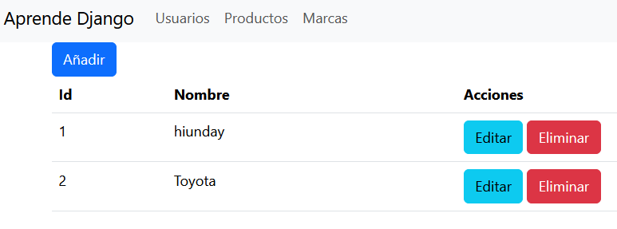

Ahora si intentamos añadir un nombre repetido, nos dará error ya que pusimos que ese campo era único (el form de Django hace esa validación automáticamente)
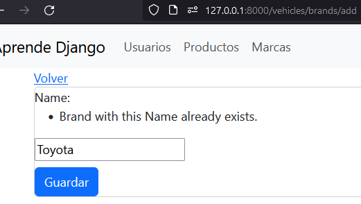

Bueno si queremos nuestra validación y campo en español tenemos que hacer un par de cambios, primero cambiar al campo `name` del modelo `Brand`, agregando el parámetro `verbose_name="Nombre"`. Y añadiendo la subclase `Meta` con el atributo `verbosa_name = "marca"`

`vehicles/models.py`
```python
from django.db import models


class Brand(models.Model):
  class Meta:
        verbose_name = "marca"

  name = models.CharField(max_length=100, unique=True, verbose_name="nombre") # Línea editada

...
```
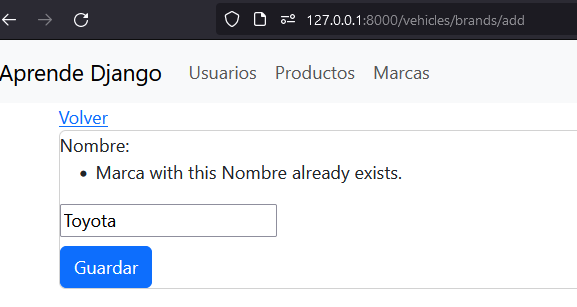
Ya nos cambio el nombre del campo y del modelo, ahora para cambiar la validación editamos el `settings.py` vamos a donde dice `LANGUAGE_CODE = 'en-us'` y lo cambiamos por LANGUAGE_CODE = 'es'. Guardamos y listo
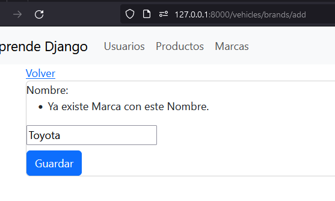

### Creando vistas en Django con Clases especiales
Ahora vamos a implementar otra forma de crear un CRUD usando clases de Django, lo haremos para nuestro modelo `Vehicle`.
Editamos nuestras vistas

`vehicle/views.py`
```python
from django.shortcuts import redirect, render
from django.urls import reverse, reverse_lazy # Agregado reverse_lazy
from .models import Brand, Vehicle # Agregado Vehicle
from .forms import BrandForm, VehicleForm # Agregado VehicleForm
from django.views.generic.list import ListView # Línea agregada
from django.views.generic.edit import CreateView, UpdateView, DeleteView # Línea agregada


...


class VehicleListView(ListView):
    model = Vehicle


class VehicleAddView(CreateView):
    model = Vehicle
    form_class = VehicleForm
    success_url = reverse_lazy("author-list") 


class VehicleEditView(UpdateView):
    model = Vehicle
    form_class = VehicleForm
    success_url = reverse_lazy("author-list") 


class VehicleDeleteView(DeleteView):
    model = Vehicle
    success_url = reverse_lazy("author-list") 
    # success_url es el URL a redirigir cuando elimina la vista exitosamente
    # puedes colocar un success_url en un CreateView o en UpdateView
    # cuando el url está en un atributo de clase se usa reverse_lazy en vez de reverse
```
Y con esas pocas líneas de código ya tenemos nuestro CRUD hecho, estás son vistas genericas de Django. Aparte de estas vistas hay más [que puedes consultar aquí](https://docs.djangoproject.com/en/5.0/ref/class-based-views/). 
Te preguntaras, ¿y el HTML? Bueno las vistas genéricas buscan un patrón especifico para conseguir la plantilla html correcta. En el caso de un ListView este busca la plantilla que tenga el nombre del modelo y termine en `_list.html`. Así que en este caso crearemos nuestro archivo

`templates/vehicles/vehicle_list.html`
```jinja



    <a href="" class="btn btn-primary">Añadir</a>
    <table class="table">
        <thead>
            <tr>
                <th>Id</th>
                <th>Marca</th>
                <th>Año</th>
                <th>Foto</th>
                <th>Tipo</th>
                <th>Modelo</th>
                <th>Precio</th>
                <th>Fecha creación</th>
                <th>Acciones</th>
            </tr>
        </thead>
        <tbody>
            
            <tr>
                <td>{{ vehicle.id }}</td>
                <td>{{ vehicle.brand.name }}</td>
                <td>{{ vehicle.year }}</td>
                td>
                    
                </td>
                <td>{{ vehicle.type }}</td>
                <td>{{ vehicle.model }}</td>
                <td>{{ vehicle.price }}</td>
                <td>{{ vehicle.created_at }}</td>
                <td>
                    <a href="" class="btn btn-info">Editar</a>
                    <a href="" class="btn btn-danger">Eliminar</a>
                </td>
            </tr>
            
        </tbody>
    </table>
 
```
(Si quieres colocar otro nombre a tu html, le colocas el atributo `template_name = "mi_archivo.html"` en cualquiera de las vistas genéricas )

Para un CreateView o un UpdateView busca la plantilla html con el nombre del modelo, seguido del sufijo _form

`templates/vehicles/vehicle_form.html`
```jinja



    <style>
        form > div {
            width: 90%;
            margin: 5px auto;
        }
    </style>
    <a href=""> Volver</a>
    <div class="card text-center" style="width: 300px;">
        <h3>Formulario Vehículos</h3>
        <form action="" method="post" enctype="multipart/form-data">
            
            {{ form.as_div }}  
            <button type="submit" class="btn btn-primary my-2">Guardar</button>
        </form>
    </div>
 
```
Aquí al form le agregamos el `.as_div` para que genere los inputs dentro de un div, y así poderlos estilizar un poco más fácil. Muy importante el atributo `enctype="multipart/form-data"` en la etiqueta form, ya que es obligatorio cuando queremos subir un archivo, sin ese atributo no funcionará. También para que nos funcione correctamente tenemos que modificar un par de archivos, empezando por el settings


`mi_proyecto/settings.py`
```python
...
# Agregamos al final estas dos líneas
MEDIA_URL = 'media/'
MEDIA_ROOT = BASE_DIR / 'media'
```

Y el urls principal

`mi_proyecto/urls.py`
```python
from django.contrib import admin
from django.urls import include, path
from django.conf import settings # Línea agregada
from django.conf.urls.static import static # Línea agregada
urlpatterns = [
    path("", include("auth.urls")),
    path("vehicles/", include("vehicles.urls")), 
    path("admin/", admin.site.urls),
]

# Código agregado
if settings.DEBUG:
    urlpatterns += static(settings.MEDIA_URL, document_root=settings.MEDIA_ROOT)
```

Y ya nuestra aplicación esta preparada para subir archivos.

Volviendo a las vistas genéricas, el DeleteView elimina el modelo en el método POST, y en el GET carga un html que tiene que llamarse igual que el modelo y terminar en `_confirm_delete.html`. Creamos este archivo

`templates/vehicles/vehicle_confirm_delete.html`
```jinja


<a href="">Volver</a>
<form method="post">
    <p>Estás seguro de eliminar "{{ object }}"?</p>
    {{ form }}
    <button type="submit" class="btn btn-danger"> Confirmar</button>
</form>

```

Por último configuramos nuestras rutas

`vehicles/urls.py`
```python
from django.urls import path
from . import views

urlpatterns = [
    path("brands", views.view_brands, name="brand-list"),
    path("brands/add", views.add_brand, name="brand-add"),
    path("brands/edit/<int:id>", views.edit_brand, name="brand-edit"),
    path("brands/delete/<int:id>", views.delete_brand, name="brand-delete"),
    # Código agregado
    path("vehicles", views.VehicleListView.as_view(), name="vehicle-list"),
    path("vehicles/add", views.VehicleAddView.as_view(), name="vehicle-add"),
    path("vehicles/edit/<int:pk>", views.VehicleEditView.as_view(), name="vehicle-edit"),
    path("vehicles/delete/<int:pk>", views.VehicleDeleteView.as_view(), name="vehicle-delete"),
]
```
Cuando se usa vistas genéricas el argumento debe llamarse `pk`, en un modelo el `pk` es lo mismo que el `id`

Guardamos y probamos...

Un segundo...

Nuestro formulario de Vehículos no luce muy bien
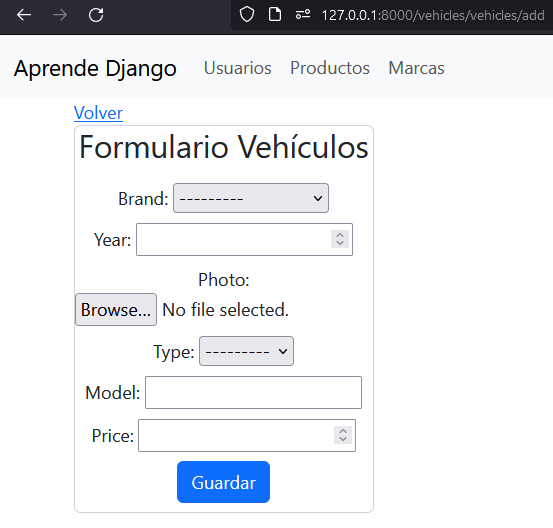
y en Brand no se distingue cuál es cuál. Primero arreglaremos esto agregando la función mágica str al modelo (Está función se ejecuta cuando una clase es transformada a texto)

`vehicles/models.py`

```python
from django.db import models


class Brand(models.Model):
    class Meta:
        verbose_name = "marca"

    name = models.CharField(max_length=100, unique=True, verbose_name="nombre")

    # Agregamos está función mágica para que devuelva el nombre de la marca
    def __str__(self) :
        return self.name


class Vehicle(models.Model):
    class Type(models.IntegerChoices):
        MOTO = 1, "Moto"
        CAR = 2, "Carro"
        TRUCK = 3, "Camión"

    brand = models.ForeignKey(Brand, on_delete=models.DO_NOTHING)  # Marca
    year = models.IntegerField() # Año
    photo = models.FileField(upload_to="vehicles") # Foto
    type = models.IntegerField(choices=Type.choices)   # Tipo de vehículo
    model = models.CharField(max_length=100, unique=True)  # Modelo del vehículo
    price = models.IntegerField() # Precio
    created_at = models.DateTimeField(auto_now_add=True) # Fecha de creación

    # Agregamos está función mágica para que devuelva el nombre del modelo junto a su marca
    def __str__(self) :
        return self.brand.name + self.model
```
Ya arreglamos nuestra marca, pero para nuestro formulario queremos colocar la clase de bootstrap `form-control` a cada uno de nuestros inputs, una manera de hacer esto es editando nuestro forms.py

`vehicles/forms.py`
```python
from django.forms import ModelForm
from .models import Brand, Vehicle

class BrandForm(ModelForm):
    class Meta:
        model = Brand
        fields = '__all__'


class VehicleForm(ModelForm):

    # Añadimos está función
    def __init__(self, *args, **kwargs):
        super(VehicleForm, self).__init__(*args, **kwargs)
        for visible in self.visible_fields():
            visible.field.widget.attrs['class'] = 'form-control'

    class Meta:
        model = Vehicle
        exclude = ['created_at']
```
Aquí sobre-escribimos el constructor que hereda de ModelForm, por lo que llamamos primero al constructor que se hereda con `super(VehicleForm, self).__init__(*args, **kwargs)`. Luego iteramos los campos visibles de nuestro formulario, y ahí le añadimos al atributo class el valor de form-control. (Puede que esta manera sea algo compleja, siempre puedes colocar los forms en el HTML manualmente para mayor personalización).

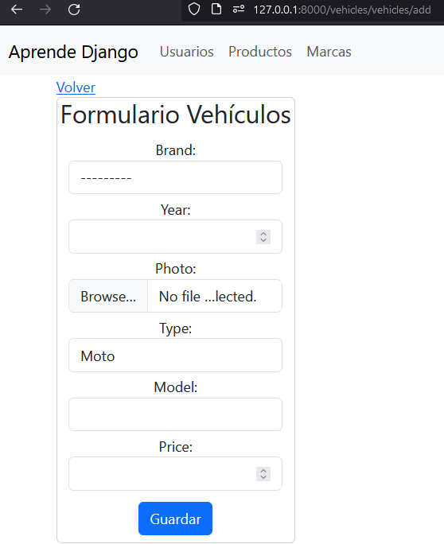

Mucho mejor 😉 Como ejercicio te reto a colocar todos los campos en español.

Guarda y edita bien... pero hay algo raro en la tabla, el campo tipo me muestra solo un número, ¿Como puedo arreglar esto?
Pues vamos a crear una función que nos devuelva el texto del tipo de vehículo en nuestro modelo
```python
from django.db import models


class Brand(models.Model):
    class Meta:
        verbose_name = "marca"

    name = models.CharField(max_length=100, unique=True, verbose_name="nombre")

    def __str__(self) :
        return self.name


class Vehicle(models.Model):
    class Type(models.IntegerChoices):
        MOTO = 1, "Moto"
        CAR = 2, "Carro"
        TRUCK = 3, "Camión"

    brand = models.ForeignKey(Brand, on_delete=models.DO_NOTHING)  # Marca
    year = models.IntegerField() # Año
    photo = models.FileField(upload_to="vehicles") # Foto
    type = models.IntegerField(choices=Type.choices)   # Tipo de vehículo
    model = models.CharField(max_length=100, unique=True)  # Modelo del vehículo
    price = models.IntegerField() # Precio
    created_at = models.DateTimeField(auto_now_add=True) # Fecha de creación

    def __str__(self) :
        return self.brand.name + self.model

    # Agregamos está función
    def type_label(self):
        return self.Type(self.type).label
```
Aquí creamos la función type_label, que devuelve el label según la clase `Type`, que toma como parámetro el valor actual de `type`.

Para terminar editamos el html `templates/vehicles/vehicle_list.html` buscamos la línea que aparece así `<td>{{ vehicle.type }}</td>` y la cambiamos por `<td>{{ vehicle.type_label }}</td>`

Y ya estaríamos listo con nuestro CRUD, como pudiste observar puedes hacerlo de diferentes formas, usando formularios Django o no usarlos (como en nuestro login), usando funciones o usando clases genéricas.

El código del proyecto que estamos haciendo está en este repositorio, por si tienes algún error poder comparar ahí

## Pendientes

Próximo episodios a desarrollar:
- Crear paginación en las vistas
- Crear filtros en las vistas
- Usar mensajes en Django
- Colección de Recursos para Django

## Buenas Prácticas

A continuación una lista de recomendaciones para que tu código Django sea limpio, bonito y escalable. No es necesario seguirlas para que tu código funcione, sin embargo si son altamente recomendables

### Python General
1. En Python, los nombres de las variables y funciones son todo en minúscula, separados por barra baja de ser necesario *Bien* `fecha_nacimiento = "27/10/2000"` *Mal* `fechanacimiento = "27/10/2000"` o `FechaNacimiento = "27/10/2000`
2. El nombre de clases siempre empieza con mayúscula, al igual que cada inicial de las palabras *Bien* `class Perro` o `class MarcaRopa` *Mal* `class perro` o `class marcaropa` o `marcaRopa`
3. El nombre de constantes va con todas las letras en mayúsculas, separadas por barra baja *Bien* `GRAVEDAD_TIERRA = 9,80665` o `MILLA = 1.60934`
4. Colocar un espacio entre variable-igual y igual-valor *Mal* `peso=12` o `peso= 12` *Bien* `peso = 12`
5. El nombre de las variables debe ser descriptivo, osea debe relacionarse al valor que posee. *Mal* `nombre = 42` o `a = "José"` *Bien* `nombre = "Pedro"`
6. Se debe evitar abreviar el nombre de las variables (a menos que sea una abreviación muy conocida), así sean mucho más corto, ya que es difícil comprender que significa cada abreviación. *Mal* `ci = 1234` *Bien* `cedula = 1234`.
7. Los imports siempre van arriba del documento, antes de declarar variables/funciones/etc.
8. (Recomendación personal) Escribir los nombres de las variables, constantes, atributos, clases, funciones, métodos en inglés, ya que el inglés es un estándar en el mundo de la programación, y así vas practicándolo (usando Google Traductor :P)


### Django
1. Cuando creas un modelo, no repitas el nombre del modelo cuando crees sus campos. Es redundante 

*Mal*
```python
class Perro(models.Model):
    nombre_perro = models...
    edad_perro = models...
```

*Bien*
```python
class Perro(models.Model):
    nombre = models...
    edad = models...
```

2. El nombre de los modelos generalmente es en singular, *mal* `class Perros` *bien* `class Perro`

3. (Recomendación) A las clases de tus forms añádele el sufijo Form `class PerroForm`, igual a las clases de tus views añade el sufijo View `class PerroView` `class EditarPerroView`. A las de Models no le agregues ningún sufijo/prefijo `class Perro`

4. En el base.html que uses recomiendo tener un bloque para lo que va en la etiqueta head, como el css. Un bloque para el contenido en sí. Un bloque para el javascript, que iría justo antes de la etiqueta cierre de body, y un bloque para las modales (si es que usas modales) justo antes del javascript.

5. En los archivos html de Django no uses rutas como `/usuarios/editar/{{ user.id }}`. En su lugar usa ``

6. Trata de crear una carpeta con el mismo nombre de la app en tus templates, así vas a ubicar fácilmente tus archivos html.
